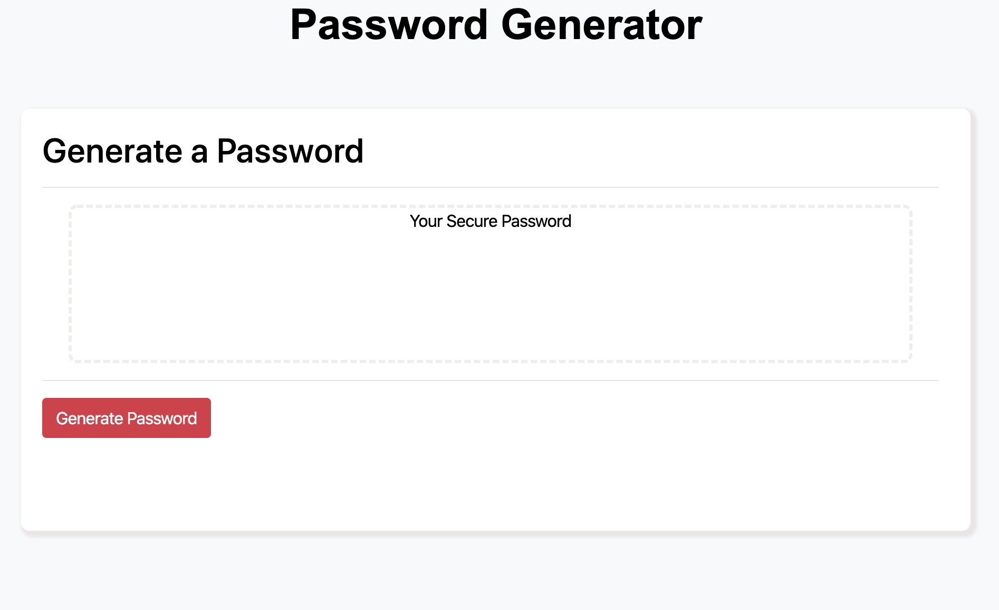

# password-generator


## Site Picture 

   

## Summary 

The task in this project was to build a password generator. The application would prompt the user ot select whether or not they would like certain characters in their password then generate that password randomly as long as the user input met the conditions required.

## Technologies Used
- Javascript - prompts user, gernerates random password based on user input using conditionals, arrays, strings, functions, and loops.
- Bootstrap - Used to pull existing html and CSS for creating resposive organizational structer and styling for the site.
- HTML - used to create elements on the DOM
- CSS - styles html elements on page
- Git - version control system to track changes to source code
- GitHub - hosts repository that can be deployed to GitHub Pages
 


## Code Snippet

Beascuse I began with a string of characters rather than an array it made it dificult to look back at the activities and code drills to figure out how to get my for loop and random calculation to work properly. I could store all the user input into a variable however when running my for loop it would only output one varible. It wasnt until I figured out that I needed to "join" the array that i had created based on user input into a string that could be used in my for loop to generate a password at the length specified with the character type that the user chose. This was the cruxed of this project and made me realize that how I structure my information in the beginning really matters beacuse it informs the direction the rest of the development process is going to take and either provides more options or limits them.
```js
var newPWstr = newPassWd.join("");
 
var password = "";

for (var i = 0; i < pWlenght; i++) {
var genChr = newPWstr.charAt(Math.floor(Math.random() * newPWstr.length));
password = password.concat(genChr);
}
```


## Built With

* [HTML](https://developer.mozilla.org/en-US/docs/Web/HTML)
* [CSS](https://developer.mozilla.org/en-US/docs/Web/CSS)
* [Boostrap](https://getbootstrap.com/)

## Authors

**Chris Melby** 

- [Link to Portfolio Site](#)
- [Link to Github](https://github.com/cmelby)
- [Link to LinkedIn](https://www.linkedin.com/in/chris-melby-71106b126/)